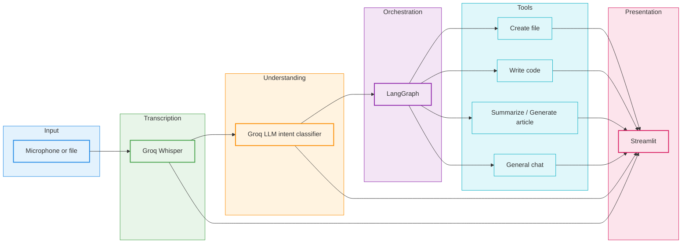
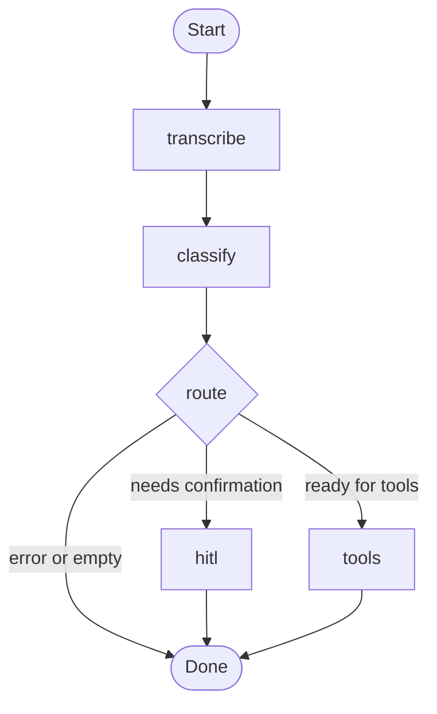

# Voice-Controlled AI Agent

Local pipeline UI that records or uploads audio, transcribes with **Groq Whisper**, classifies intent with **Groq LLM (e.g. Llama 3.3)**, runs tools via **LangGraph**, and shows transcription, intent, action, and output. All file writes stay under `output/`.

## Architecture



Nothing here is magic: each rectangle is ordinary Python on the other side of an HTTP call. The point of drawing it is to show where **trust** enters the system—at the tool boundary, not inside the microphone.

---

## Workflow



## Features

- **Audio**: microphone (browser) or `.wav` / `.mp3` / `.m4a` / `.webm` / `.flac` upload
- **STT**: Groq `whisper-large-v3-turbo` (or override `GROQ_WHISPER_MODEL`)
- **Intent**: create file, write code, summarize, general chat; optional **compound** multi-step JSON from the classifier
- **Safety**: paths resolved only inside [`output/`](output/); no shell execution
- **HITL**: optional confirmation before `create_file` / `write_code`
- **Session memory**: last few turns passed into classification / chat context

## Why cloud APIs (not local models)

This assignment variant uses **Groq** for both Whisper and chat so a typical laptop can run the UI without GPU-heavy local STT/LLM. If you need fully offline behavior, swap `services/stt.py` / `services/llm.py` for local Whisper + Ollama and keep the same LangGraph graph.

## Setup

1. **Python 3.10+** recommended.

2. Create a virtual environment (avoids conflicts with other `langchain` installs):

   ```bash
   python -m venv .venv
   .venv\Scripts\activate
   ```

3. Install dependencies:

   ```bash
   pip install -r requirements.txt
   ```

4. Copy `.env.example` to `.env` and set your Groq API key:

   ```env
   GROQ_API_KEY=your_key_here
   ```

5. Run Streamlit from this folder:

   ```bash
   streamlit run app.py
   ```

## Architecture

1. **Streamlit** (`app.py`) captures audio, builds `AgentState`, calls the graph.
2. **LangGraph** (`agent/graph.py`): `transcribe` → `classify` → (optional `hitl`) → `tools` → `END`.
3. **Services**: `services/stt.py` (Whisper), `services/llm.py` (chat completions).
4. **Tools** (`tools/`): file creation, code generation, summarization, chat.
5. **Sandbox**: `utils/sanitize.py` + `config.OUTPUT_DIR` restrict writes to `output/`.

## Environment variables

| Variable | Default | Purpose |
|----------|---------|---------|
| `GROQ_API_KEY` | _(required)_ | Groq API authentication |
| `GROQ_LLM_MODEL` | `llama-3.3-70b-versatile` | Chat / intent / codegen |
| `GROQ_WHISPER_MODEL` | `whisper-large-v3-turbo` | Transcription |

## Project layout

```
voice-ai-agent/
├── app.py
├── config.py
├── requirements.txt
├── output/              # sandbox for created files (gitignored contents)
├── agent/               # state, LangGraph, intent prompts, memory
├── services/            # Groq STT + LLM clients
├── tools/               # tool implementations
└── utils/               # audio + path safety
```

## Error handling

- STT / LLM calls retry with exponential backoff (`services/`).
- Malformed intent JSON falls back to `general_chat` inside `classify_intent`.
- Unsafe paths raise before writing; the UI shows a short message, not tracebacks.

## Bonus features implemented

- **Compound commands**: classifier can return `compound: true` and `intents` steps; `tools` node runs them in order.
- **Human-in-the-loop**: sidebar toggle + approve/cancel when file tools would run.
- **Graceful degradation**: empty audio, STT failures, and parse errors surface as safe messages.
- **Memory**: session history stored in Streamlit state and fed into intent classification.

## License

MIT (adjust as needed for your course submission).
